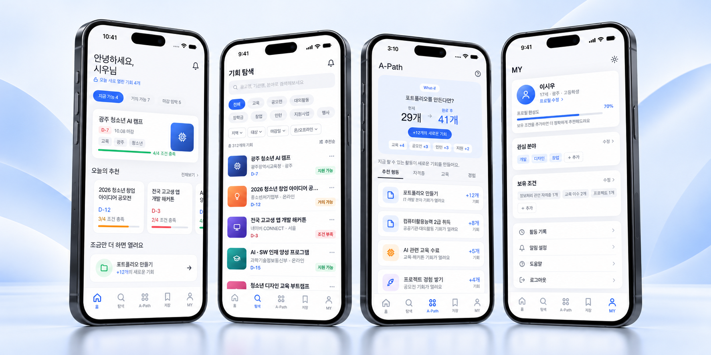
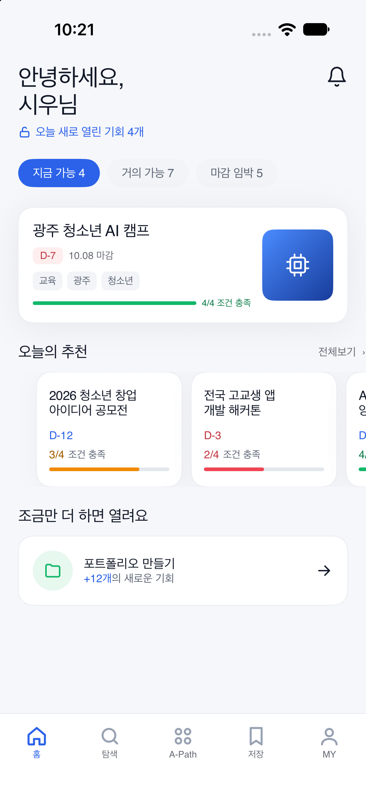
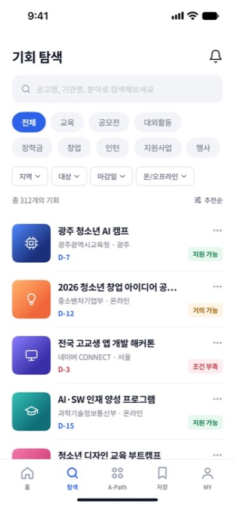
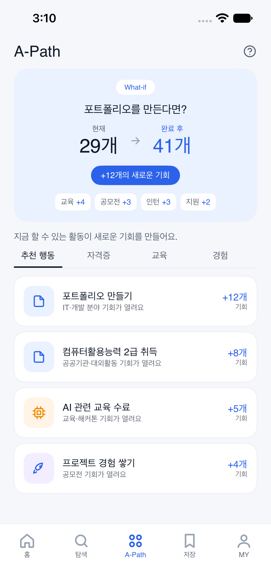
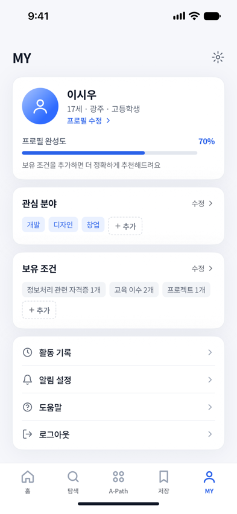

<div align="center">
  <h1>FINDR</h1>
  <p><strong>현재의 나와 미래의 기회를 연결합니다.</strong></p>
  <p>나에게 맞는 기회를 발견하고, 지원 조건을 확인하고,<br>다음에 할 일을 계획하는 iOS 앱</p>
  <p>
    <a href="https://github.com/TEAM-FINDR/FINDR-iOS-v1/actions/workflows/ios-ci.yml"></a>
    
    
    
  </p>
</div>

## FINDR 소개

FINDR는 공모전, 교육, 창업, 대외활동처럼 흩어져 있는 기회를 한곳에서 살펴보고, 내 조건에 맞는 기회를 찾도록 돕는 iOS 앱입니다. 자격과 마감일을 확인한 뒤 관심 있는 기회를 저장하고, A-Path에서 다음 준비 행동을 계획할 수 있습니다.

## 주요 기능

- **맞춤 홈** — 지원 가능한 기회, 조건을 더 채우면 지원할 수 있는 기회, 마감이 가까운 기회를 살펴봅니다.
- **기회 탐색** — 검색어와 분야, 지역, 대상, 마감일, 진행 방식으로 기회를 찾고 정렬합니다.
- **기회 상세** — 지원 자격, 일정, 제출 서류, 문의처를 확인하고 관심 기회를 저장합니다.
- **A-Path** — 조건을 추가했을 때 열리는 기회를 확인하고, 포트폴리오나 자격증 같은 준비 행동을 계획합니다.
- **MY 프로필** — 관심 분야와 보유 조건을 관리해 추천에 필요한 정보를 정리합니다.

## 화면 미리보기

<p align="center">
  
</p>

<p align="center"><sub>FINDR의 대표 화면을 기기에 배치한 소개용 목업입니다. 실제 화면 캡처는 아래에서 확인할 수 있습니다.</sub></p>

### 앱 화면 캡처

<table>
  <tr>
    <td align="center"></td>
    <td align="center"></td>
    <td align="center"></td>
    <td align="center"></td>
  </tr>
  <tr>
    <td align="center"><strong>홈</strong></td>
    <td align="center"><strong>기회 탐색</strong></td>
    <td align="center"><strong>A-Path</strong></td>
    <td align="center"><strong>MY</strong></td>
  </tr>
</table>

전체 화면 대조 기록은 [Figma 화면 감사 문서](Docs/figma-screen-audit.md)에서 볼 수 있습니다.

## 기술 스택

| 구분 | 사용 기술 |
| --- | --- |
| 앱 | Swift, SwiftUI |
| 프로젝트 생성 | Tuist 4.202.0 |
| 최소 지원 버전 | iOS 17.0 |
| 테스트 | XCTest |
| 자동 검증 | GitHub Actions — iOS Simulator 빌드 및 테스트 |

## 시작하기

### 요구 사항

- macOS 및 Xcode
- [Tuist](https://tuist.io/) 4.202.0 — 버전은 `.tool-versions`에 고정되어 있습니다.

### 프로젝트 생성 및 실행

```bash
tuist install
tuist generate --no-open
open FINDR.xcodeproj
```

Xcode에서 `FINDR` 스킴과 실행할 시뮬레이터를 선택한 뒤 실행합니다. 실기기에서 실행하려면 `Signing & Capabilities`에서 사용 가능한 Apple Development 팀을 선택해야 합니다.

### 빌드 및 테스트

```bash
xcodebuild build \
  -project FINDR.xcodeproj \
  -scheme FINDR \
  -destination 'generic/platform=iOS Simulator' \
  CODE_SIGNING_ALLOWED=NO

xcodebuild test \
  -project FINDR.xcodeproj \
  -scheme FINDR \
  -destination 'platform=iOS Simulator,name=iPhone 17,OS=latest' \
  CODE_SIGNING_ALLOWED=NO
```

## 프로젝트 구성

```text
Sources/
├── Components/    재사용 가능한 화면 구성 요소
├── DesignSystem/  색상, 타이포그래피, 공통 UI
├── Features/      홈, 탐색, 상세, A-Path, 저장, MY, 온보딩
└── Models/        화면 모델과 샘플 기회 데이터
Resources/         이미지 에셋과 폰트
Tests/             XCTest
Docs/              화면 캡처와 Figma 대조 기록
```

## 데이터 연동 상태

현재 저장소는 화면 흐름을 확인할 수 있는 앱 빌드입니다. 기회 목록과 추천은 앱 내 샘플 데이터를 사용하고, 프로필은 기기 로컬에 저장됩니다. 서버 API와 계정 간 데이터 동기화는 아직 연결되어 있지 않습니다.
